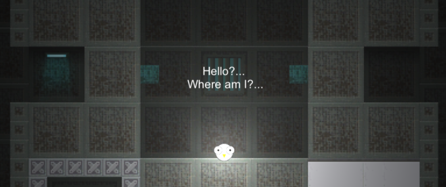
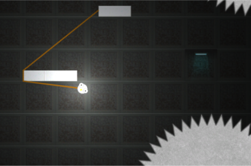

# Roped

Help the trapped chicken to escape the lab complex!

Using an implanted rope the player needs to solve various puzzles to reach the goal of the level.

In the context of a lecture we implemented a game prototype using the Unity engine. Our main goal was to create a simple but addictive game. The player should experience a limited amount of frustration but only so much that the player still keeps hooked.

### Used Tools
- Unity engine
- [Tiled map editor](http://www.mapeditor.org/)

### Target platform: 
- PC (Keyboard)
- Android/iOS (Not fully supported, may be buggy)

### External assets:
- Tilemap: [opengameart.org](http://www.opengameart.org)
- Sounds: [purple-planet.com](http://www.purple-planet.com) and [purple-planet.com](http://www.purple-planet.com)